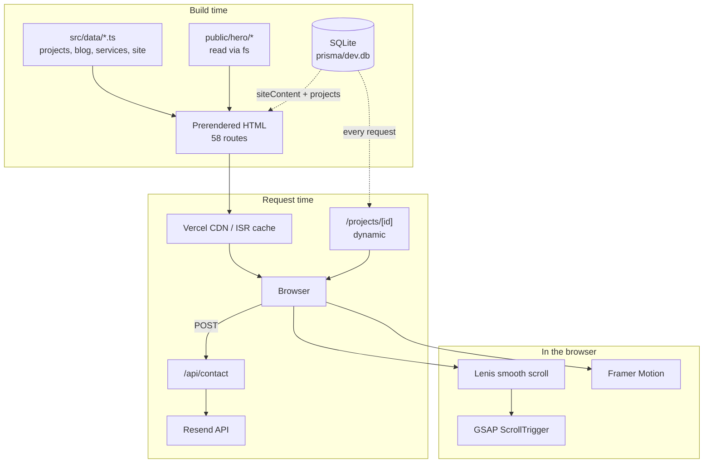

# ARCHITECTURE

How the application is put together and why.

---

## 1. Shape of the system

A **content-first static site** with one dynamic island. Almost everything is prerendered
at build time from TypeScript data files; a database exists but serves only the legacy
`/projects` pages.



---

## 2. Rendering strategy per route

| Route | Mode | Data at build | Data at request |
|---|---|---|---|
| `/` | Static, `revalidate 3600` | `src/data/*` + `siteContent` | — |
| `/work`, `/services`, `/blog`, `/case-studies` (+ 46 SSG children) | Static / SSG | `src/data/*` | — |
| `/about` | Static, `revalidate 60` | `site.ts` + `siteContent` | — |
| `/contact` | Static | — | — |
| `/projects` | Static, `revalidate 60` | `project.findMany()` | — |
| `/projects/[id]` | **Dynamic (`ƒ`)** | — | `project.findUnique()` + `siteContent` |
| `/api/contact` | Dynamic | — | POST body |

`generateStaticParams` produces 13 service pages, 7 blog posts and 26 case studies.

---

## 3. Application flow

### Every request
```
layout.tsx  (server)
  ├─ next/font: Inter + DM_Mono → CSS variables
  ├─ <head>: <noscript> un-hides [data-animate], hides [data-loader]
  ├─ skip-to-content link
  └─ MainLayout  (server)  ──► prisma.siteContent.findUnique()
        └─ MotionProvider  (client, MotionConfig reducedMotion="user")
              ├─ Loader          (client, SSR-visible, min 1400 ms)
              ├─ Cursor          (client, pointer:fine only)
              ├─ SmoothScroll    (client, Lenis → GSAP ticker)
              ├─ ScrollProgress  (client, useScroll → scaleX)
              ├─ Navbar          (client)
              ├─ <main id="main">  ← template.tsx → page.tsx
              ├─ Footer          (client)
              └─ FloatingWhatsApp (client)
```

`template.tsx` sits between layout and page, so it remounts on every navigation — that is
what gives page transitions.

### Homepage composition
`src/app/page.tsx` renders 13 sections in order. Eleven are wrapped in `next/dynamic` for
code-splitting:

```
HeroSection → BrandsStrip → WorkSection → ServicesSection → ProcessSection
→ ApproachSection → TestimonialsSection → ShowcaseSection → TechStack
→ AboutSection → FaqSection → BlogPreviewSection → ContactSection
```

> Note: `next/dynamic` inside a server component still server-renders the section and
> still ships it in the first-load graph, so the win here is modest. Do not expect it to
> reduce initial JS much.

---

## 4. Client / server boundary

**Server components:** every `page.tsx`, `layout.tsx`, `MainLayout`, and the presentational
atoms `Container`, `GlassCard`, `Heading`, `Text`, `Logo`, `ProjectImage`.

**Client components:** everything that animates or holds state — all of `providers/`, most
`organisms/`, and the animating atoms (`AnimatedText`, `ScrollRevealText`, `Cursor`,
`Magnetic`, `MediaReveal`, `ScrollProgress`).

The rule the codebase follows: **data fetching and composition stay on the server;
animation and interaction go to the client.** Sections receive already-fetched data as
props (`config`, `slides`, `projects`) rather than fetching themselves.

Two consequences worth knowing:
- `src/lib/hero-slides.ts` uses `fs.readdirSync` — importing it from a client component
  breaks the build.
- `src/data/*` modules must never import React, because both server and client components
  consume them.

---

## 5. Data flow

```
src/data/*.ts  ──►  page.tsx (server)  ──►  organism (client)  ──►  DOM
                         │
prisma ──► lib/db-project.ts ──► Project
```

Three derived layers sit on top of the raw data:

| Derivation | File | What it does |
|---|---|---|
| Project merge | `data/projects.ts` | `[...storeProjects, ...customProjects, ...otherProjects]` |
| Project grouping | `data/projects.ts` | `getProjectGroup()` → `shopify` / `wordpress` / `custom`, drives `/work` filters |
| Case studies | `lib/case-studies.ts` | `projects.filter(p => p.challenge && p.approach && !p.id.includes("placeholder"))` → 26 items |

`lib/db-project.ts` is the single adapter between the DB and the app's `Project` type. It
also acts as a **security boundary**: `safeImageUrl()` drops any image URL that is not
relative or on an allow-listed host, so a poisoned DB row degrades to a placeholder
instead of crashing the page.

---

## 6. State management

There is **no state library** and none is needed.

| Kind of state | How it is handled |
|---|---|
| Server data | Fetched in server components, passed as props |
| UI state (menu open, active accordion, filter) | Local `useState` in the owning organism |
| Scroll position | Framer `useScroll` / GSAP ScrollTrigger — never React state |
| Continuous animation (showcase arc) | `requestAnimationFrame` writing transforms directly to the DOM — **zero React re-renders by design** |
| Media queries | `useSyncExternalStore` in `hooks/useMediaQuery.ts` |
| Reduced motion | `MotionConfig reducedMotion="user"` + `usePrefersReducedMotion()` |
| Sound toggle | `localStorage`, inside `Navbar` |

Do not introduce Redux/Zustand/Context for UI state. The current approach is deliberate
and performs better for a site this animation-heavy.

---

## 7. External services

| Service | Where | Notes |
|---|---|---|
| **Resend** | `src/app/api/contact/route.ts` | Client instantiated **inside** the POST handler, not at module scope — doing it at module scope broke the Vercel build when the key was absent |
| **Google Fonts** | `src/app/layout.tsx` via `next/font` | Self-hosted at build, `display: swap` |
| **Cloudinary** | allow-listed in `next.config.ts` + `lib/db-project.ts` | Only legacy DB image URLs; the `cloudinary` npm package is **not** used |
| **Prisma / SQLite** | `prisma/` | See *Known constraints* |

---

## 8. Architectural decisions worth knowing

**Design tokens were extracted from a reference site's compiled CSS, not estimated.**
That is why `globals.css` has oddly specific values like `clamp(48px, 6vw, 96px)` and
`cubic-bezier(0.16, 1, 0.3, 1)`. Do not "round" them.

**Content lives in TypeScript, not a CMS or MDX.** `blog.ts` models posts as a
discriminated `Block` union (`p` | `h2` | `ul` | `quote`) rendered by a switch. This keeps
type safety and avoids an MDX pipeline, at the cost of verbose authoring.

**Three animation libraries coexist, each for a different job.** Framer Motion for
declarative component animation, GSAP for scroll-driven timelines and pinning, Lenis for
scroll inertia. They are wired together in `SmoothScroll.tsx`: Lenis drives GSAP's ticker
and calls `ScrollTrigger.update`. This is the fragile part of the system — see
`ANIMATIONS.md`.

**`src/lib/motion.ts` exists to solve a TypeScript problem.** Inline Framer variants with
`type: "spring"` widen to `string` and previously produced 28 type errors. Centralising
typed `Variants`/`Transition` objects fixed it. Keep new variants there.

**Atomic design (atoms/molecules/organisms/templates)** is the folder convention. It is
loosely applied — `organisms/` is really "page sections" — but it is consistent, so follow
it rather than reorganising.

---

## 9. Known constraints

### 🔴 The database blocks deployment
`prisma/dev.db` is gitignored and `provider = "sqlite"`. On Vercel there is no database
file, so:
- the build-time prerenders of `/`, `/about`, `/projects` throw,
- `/projects/[id]` returns **500** at request time,
- other routes survive only by serving the build-time ISR cache, and silently stop
  updating once `revalidate` expires.

Verified by running the server with an unreachable `DATABASE_URL`:
`Error code 14: Unable to open the database file`.

Two ways out:
1. Move to hosted Postgres (Neon/Supabase), change the provider, add `prisma migrate
   deploy` to the build.
2. **Simpler:** drop Prisma from the public routes. `src/data/*` already holds every real
   project; `/projects` duplicates `/work`.

### `MainLayout` is a single point of failure
Its `prisma.siteContent.findUnique()` is now wrapped in `.catch(() => null)` so a DB
outage degrades the chrome instead of taking down all 58 routes. `Navbar` and `Footer`
already accept `config` as optional.

### The admin CMS was removed
`/dashboard`, NextAuth and the signup/signin routes were deleted in an earlier phase. The
orphaned forms and server actions that remained have now been removed too (see
`CHANGELOG.md`). `prisma/schema.prisma` still declares a `User` model with a `password`
column that nothing uses.

---

## 10. Build & deploy

```bash
npm run dev      # next dev
npm run build    # next build --webpack
npm run start    # next start
npm run lint     # eslint
npm run images   # re-encode public/projects to WebP
```

`postinstall` runs `prisma generate`. Target is Vercel. `next.config.ts` sets
`poweredByHeader: false`, the image remote allow-list, AVIF/WebP formats, and seven
security headers including CSP.

Current state: `tsc --noEmit` 0 errors, `eslint src` 0 problems, `next build` exit 0 with
zero warnings.
